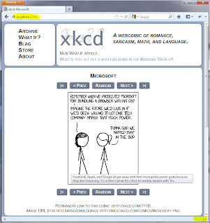

When people ask: What would I use a TCP Forwarding tool for?

Normally the answer goes like "to eavesdrop someone's connection".

Most of our connections go over SSL (at least the most important ones) and the certificate would be invalidated in case a MITM would be on going.

There are some troubleshooting situations when one would use a TCP forwarding tool as a proxy from one box to another but on what basis this technique/tool is used can vary a lot.

There are many TCP forwarding tools available on the web. However, the truth is that no one wants to get a whole solution out of a compressed file, fire Visual Studio when accessing a computer via command line (read: reverse shell here?). On top of that, I wanted to have some fun, so I decided to write one.

And how complicated is to write a TCP Forwarding tool? Or a TCP proxy if you prefer, in C#?

It takes only 66 lines of code using plain Socket class. And it's fun!

```csharp
using System;
using System.Net;
using System.Net.Sockets;

namespace BrunoGarcia.Net
{
    public class TcpForwarderSlim
    {
        private readonly Socket _mainSocket = new Socket(AddressFamily.InterNetwork, SocketType.Stream, ProtocolType.Tcp);

        public void Start(IPEndPoint local, IPEndPoint remote)
        {
            _mainSocket.Bind(local);
            _mainSocket.Listen(10);

            while (true)
            {
                var source = _mainSocket.Accept();
                var destination = new TcpForwarderSlim();
                var state = new State(source, destination._mainSocket);
                destination.Connect(remote, source);
                source.BeginReceive(state.Buffer, 0, state.Buffer.Length, 0, OnDataReceive, state);
            }
        }

        private void Connect(EndPoint remoteEndpoint, Socket destination)
        {
            var state = new State(_mainSocket, destination);
            _mainSocket.Connect(remoteEndpoint);
            _mainSocket.BeginReceive(state.Buffer, 0, state.Buffer.Length, SocketFlags.None, OnDataReceive, state);
        }

        private static void OnDataReceive(IAsyncResult result)
        {
            var state = (State)result.AsyncState;
            try
            {
                var bytesRead = state.SourceSocket.EndReceive(result);
                if (bytesRead > 0)
                {
                    state.DestinationSocket.Send(state.Buffer, bytesRead, SocketFlags.None);
                    state.SourceSocket.BeginReceive(state.Buffer, 0, state.Buffer.Length, 0, OnDataReceive, state);
                }
            }
            catch
            {
                state.DestinationSocket.Close();
                state.SourceSocket.Close();
            }
        }

        private class State
        {
            public Socket SourceSocket { get; private set; }
            public Socket DestinationSocket { get; private set; }
            public byte[] Buffer { get; private set; }

            public State(Socket source, Socket destination)
            {
                SourceSocket = source;
                DestinationSocket = destination;
                Buffer = new byte[8192];
            }
        }
    }
}
```

No rocket science here: using both Asynchronous (good old [CLR APM](http://msdn.microsoft.com/en-us/magazine/cc163467.aspx) in this case) and Synchronous Socket programming, few C# lines of code with one method exposed as an entry point taking the endpoints as parameter.

When I say asynchronous and synchronous, it's because the code has three synchronous methods from the Socket class been called. The first is the `Socket.Accept()` which blocks the thread until a connection is received. I chose this technique so that the Start method would never return and the main thread would handle the main socket.

The second synchronous method used is `Socket.Send`. This method also blocks the thread (in this case will be a thread from the ThreadPool due to async I/O that fired the receive callback). When one socket receives data, it forwards to the second socket in a synchronous manner, before asynchronously restarting to receive data.

In fact, a few tests I ran (where one socket is only flushing all buffer to a second socket) using `BeginSend` (asynchronous `Socket.Send`) performed slower then the synchronous `Send`.

Third, the `Socket.Connect()` which initiates the connection with the remote endpoint, where you want the data you send to the program to be forwarded to.

Once a connection is established, APM is used with `BeginReceive`/`EndReceive` to receive data. This means each pair of sockets will receive data using APM and use the same thread from the pool that called the callback to send the data to the other socket.

## Let's run it!

Previously, I just wrote a class, right? That's far from having an executable.
As I mentioned before, my idea here was not to have *yet another TCP Forwarding* tool on Github, codeplex or codeproject, with dozens of files, so that we could forward some data.

So I propose a small change to the code above:
Let's add a `static Main` method to that class and build it as a command-line application:

```csharp
static void Main(string[] args)
{
    new TcpForwarderSlim().Start(
        new IPEndPoint(IPAddress.Parse(args[0]), int.Parse(args[1])),
        new IPEndPoint(IPAddress.Parse(args[2]), int.Parse(args[3])));
}
```

After that we can compile it with:

```bash
csc /o+ /debug- /out:TcpForwarder.exe /t:exe TcpForwarderSlim.cs
```

Even though I used C# compiler version: 4.0.30319.17020, code will compile just fine even with version 2.0 of the .Net Framework. The generated assembly has size: 5,632 bytes.

Let's try it out by browsing [xkcd](http://xkcd.com/). We get their IP address and setup the tunnel:

```
C:\ping xkcd.com
Pinging xkcd.com [107.6.106.82] with 32 bytes of data:

C:\TcpForwarder.exe 127.0.0.1 12345 107.6.106.82 80
```



Great comics by the way! As usual.

Notice the address bar contains `localhost:12345`, which makes sense considering we set up the tunnel as: 127.0.0.1 port 12345 as local endpoint. On the bottom of the screenshot there's the Firefox extension [DNS Flusher](https://web.archive.org/web/2023/https://addons.mozilla.org/en-us/firefox/addon/dns-flusher/) bar that shows `::1` which is the loopback address in IPv6.

If you think I might have a copy of xkcd comics number 1118 on my hard drive (the whole page, actually) and a web server binding port 12345, that's not the case. :)

Now, we have a class file with 73 lines of code (after adding the static Main method) but there's still some manual job in order to get the tunnel working. So let's try to automate this a bit more. Perhaps scripting the whole thing?!

The code can be a lot smaller if using minification. Got a nice [hint on Stack Overflow](http://stackoverflow.com/questions/1391152/c-sharp-code-minification-tools-and-techniques) using Visual Studio find and replace with Regex: `:Wh+`

We create a script, let's say `buildTcpForwarder.cmd`, not forgetting to escape the `>` sign with `^` so that the interpreter ignores it. Note I have the path to the C# compiler (`csc.exe`) on my PATH environment variable:

```bash
echo using System; using System.Net; using System.Net.Sockets; namespace BrunoGarcia.Net { public class TcpForwarderSlim { private readonly Socket MainSocket = new Socket(AddressFamily.InterNetwork, SocketType.Stream, ProtocolType.Tcp); static void Main(string[] args) { new TcpForwarderSlim().Start( new IPEndPoint(IPAddress.Parse(args[0]), int.Parse(args[1])), new IPEndPoint(IPAddress.Parse(args[2]), int.Parse(args[3]))); } public void Start(IPEndPoint local, IPEndPoint remote) { MainSocket.Bind(local); MainSocket.Listen(5); while (true) { var source = MainSocket.Accept(); var destination = new TcpForwarderSlim(); var state = new State(source, destination.MainSocket); destination.Connect(remote, source); source.BeginReceive(state.Buffer, 0, state.Buffer.Length, 0, OnDataReceive, state); } } private void Connect(EndPoint remoteEndpoint, Socket destination) { var state = new State(MainSocket, destination); MainSocket.Connect(remoteEndpoint); MainSocket.BeginReceive(state.Buffer, 0, state.Buffer.Length, SocketFlags.None, OnDataReceive, state); } private static void OnDataReceive(IAsyncResult result) { var state = (State)result.AsyncState; try { var bytesRead = state.SourceSocket.EndReceive(result); if (bytesRead ^> 0) { state.DestinationSocket.Send(state.Buffer, bytesRead, SocketFlags.None); state.SourceSocket.BeginReceive(state.Buffer, 0, state.Buffer.Length, 0, OnDataReceive, state); } } catch { state.DestinationSocket.Close(); state.SourceSocket.Close(); } } private class State { public Socket SourceSocket { get; private set; } public Socket DestinationSocket { get; private set; } public byte[] Buffer { get; private set; } public State(Socket source, Socket destination) { SourceSocket = source; DestinationSocket = destination; Buffer = new byte[8192]; } } } } > source.cs

csc /o+ /debug- /out:TcpForwarder.exe /t:exe source.cs

TcpForwarder.exe %1 %2 %3 %4
```

Now just call the script:

```
C:\buildTcpForwarder.cmd 127.0.0.1 12345 107.6.106.82 80
```

The source file is generated, built and the tunnel starts with the parameters we passed to the script so we can check [xkcd](http://xkcd.com/) once more via TCP Forwarding.
