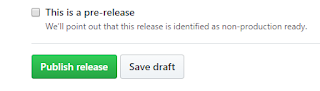
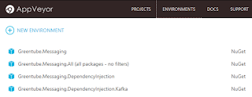

I recently setup continuous integration for a few open source projects. I used GitHub, AppVeyor, Travis-CI and Codecov. The resulting packages are deployed to NuGet.org.

Here I aim to describe the process in an attempt to document it both for myself and hopefully help others in getting started with it.

## Scenario

I have some .NET Core projects on [GitHub](https://github.com/bruno-garcia) that are actually just .NET Standard libraries.

Ultimately, once they are built and tested on Windows, MacOS and Linux, I want them published to NuGet.org. I also want to use GitHub's Release feature to document what I am pushing to NuGet.

Some of these projects actually generate more than one NuGet package. That's the case for [Greentube.Messaging](https://github.com/Greentube/messaging), [Greentube.Serialization](https://github.com/Greentube/serialization) and [Greentube.Monitoring](https://github.com/Greentube/monitoring). Depending on the change I make, I might be looking at publishing any number of those packages. I don't want to publish all packages created while building the repository every time.

## TL;DR

Travis-CI is used only to build and run tests on MacOS and Linux.
AppVeyor, which runs on Windows, builds, run tests while tracking code coverage and sends the results to [codecov.io](https://codecov.io/gh/Greentube/messaging). The result of AppVeyor's build are [artifacts](https://ci.appveyor.com/project/Greentube/messaging/build/artifacts), .nupkg files (aka: NuGet packages) ready to be sent to Nuget.org.

If AppVeyor is building a tag, it changes the build version to be the value of the tag. That sets the actual version of the NuGet packages created. Also, AppVeyor then creates a GitHub release in draft mode.

At that point from AppVeyor I can publish individual packages to NuGet with a button click.
The release notes can be added to the GitHub Release and then it can be published.

## How?

Nearly all settings to AppVeyor, Travis-CI and Codecov are defined on their respective configuration files. Although it's possible to configure all of those via their Web UI, I personally rather use the text configuration file which is version controlled.

## Travis-CI

Previously I mentioned there's no code coverage coming from the Travis-CI build. That's because as of today there's no way to do it. [OpenCover](https://github.com/OpenCover/opencover/issues/601) and [vstest](https://github.com/Microsoft/vstest/issues/981) don't support Linux or MacOS because there's still [no released profiling API](https://github.com/dotnet/coreclr/issues/445#issuecomment-338014386) for those platforms. That seems to be going to change soon though.

Nonetheless, Travis-CI is a very nice, free for open source, CI system. Changes pushed to GitHub automatically trigger a build in both Linux and MacOS:


Using the [Greentube.Messaging Travis-CI configuration file](https://github.com/Greentube/messaging/blob/master/.travis.yml) as an example: `.travis.yml`

```yaml
language: csharp
sudo: false
mono: none
os:
  - linux
  - osx
osx_image: xcode8.1
dotnet: 2.0.0
dist: trusty
env:
  global:
    - DOTNET_SKIP_FIRST_TIME_EXPERIENCE=true
    - DOTNET_CLI_TELEMETRY_OPTOUT=1
script:
 - ulimit -n 512; dotnet restore && ls test/**/*.csproj | grep -v 'Greentube.Messaging.Testing' | xargs -L1 dotnet test -c Release
```

Firstly note that `mono` is set to none since I'm building with `dotnet` here. Since tests run CoreCLR, only .NET Core SDK is required. I'm building the specific projects although from the SDK version 2.0.0 forward or so it's possible to build a solution file. That is because all I want here is to run my tests. Running `dotnet test` will build the dependent projects which in turn will run a `dotnet restore` if required. Again, this was not possible with .NET Core SDK 1.x.

The `ulimit -n 512` is there to [solve a problem](https://github.com/NuGet/Home/issues/2163) when restoring NuGet packages which open too many connections. Also while trying to [solve a problem](https://github.com/travis-ci/travis-ci/issues/8617), I've added `osx_image: xcode8.1` to be able to build with .NET Core SDK 2.0.

There're tons of other examples on how to get Travis-CI to build a .NET Core project.

## AppVeyor

Here there's more going on. Besides building all commits, including pull requests, AppVeyor will take code coverage and send it to codecov, create GitHub Releases and publish packages to NuGet.

I'm going to start by describing things before spitting the configuration file in front of you:

### Code coverage

I've tried to summarize the [code coverage setup on StackOverflow](https://stackoverflow.com/questions/39950422/show-c-sharp-code-coverage-on-github-pull-requests) before but it was never marked as an answer so here goes another try. :)

#### Configuration

All project files have an extra configuration called `Coverage` with: `DebugType=full`

The reason for the full PDB configuration is that by default it compiles with portable pdbs and those are still [not supported](https://github.com/OpenCover/opencover/issues/610).

#### Run

Code coverage is tracked with OpenCover. [I wrote a simple powershell script](https://gist.github.com/bruno-garcia/aa06a53719aca2a2c9293fca57f8b640) that will download the necessary tools and, using the .NET Core CLI, it runs all tests while tracking code coverage.

It has two optional arguments:

1. `generateReport` — Generates an HTML report useful for testing things before sending to Codecov
2. `uploadCodecov` — Sends the coverage data to [Codecov.io](https://codecov.io/gh/Greentube/messaging)

Previously I mentioned that nearly all settings are source controlled. That is not true to the API KEY used to send code coverage results to Codecov. That value is defined as an environment variable (named `CODECOV_TOKEN`) on AppVeyor.

### Packaging

The projects being built don't have their version on csproj defined before committing to GitHub.

They are always set to 0.0.0 and that gets replaced (aka patched) by AppVeyor before building and packaging it.

As mentioned before, the result of AppVeyor builds, as other CI systems, are called artifacts. What is included in the artifacts list is specified via the configuration key with that same name. A glob pattern to include all nupkg is enough: `**\*.nupkg`

Packages are created with the `dotnet pack` command. That is true to all but 1 package: the metapackage.

#### Metapackage

One thing I've left out of the summary is the creation of a [metapackage](https://docs.microsoft.com/en-us/dotnet/core/packages). That's an attempt to ease into the API adoption by providing the simplest way to get started.

Note that obviously the packages referenced by this metapackage are not included in the [runtime package store](https://github.com/dotnet/docs/blob/master/docs/core/deploying/runtime-store.md). That means that using this will in fact include the dependent packages in your publish output.

I'm publishing two metapackages, each from their own repository:

1. [Greentube.Serialization.All](https://github.com/Greentube/serialization/tree/master/src/Greentube.Serialization.All)
2. [Greentube.Messaging.All](https://github.com/Greentube/messaging/tree/master/src/Greentube.Messaging.All)

Someone wants to try the API? Run a single `dotnet add package` command and all of the building blocks are available to them.

I don't expect it to be used in production though. I advise the fine grained approach instead (pay-for-play).

#### Create

Running `dotnet pack` on a project that has no code yields no package!

The CLI will not build up an empty package. To create a metapackage you need to use a [nuspec](https://github.com/Greentube/serialization/blob/master/src/Greentube.Serialization.All/Greentube.Serialization.All.nuspec) file.

To pack this one up, there's a line in the configuration invoking `nuget pack` instead.

### Creating a Release

I've added to `.appveyor.yml` (see below) a piece of powershell which resets the version of the build to the tag if that's what's being built.

Pushing a tag is the method to express the intent of creating a release.

I'm using [semver](https://semver.org/) and NuGet already takes packages versioned `N.N.N-something` as a pre-release package.

That means a tag `1.0.0-beta` will publish a pre-release package. On the other hand, if the tag is simply `1.0.0`, that'd be a plain release.

GitHub on the other hand doesn't handle that automatically. AppVeyor creates the draft release on GitHub but at the bottom of the page before publishing, I still need to select that option:



AppVeyor will push every artifact of that build to GitHub's drafted release. Considering that I do not always publish all packages to NuGet, I remove whatever package I didn't publish to NuGet before finalizing the GitHub release.

In other words:

1. Push a tag to GitHub
2. Publish desired packages to NuGet through AppVeyor UI (more below)
3. Remove from the GitHub release the packages not deployed on the next step
4. Publish release on GitHub (green button above)

### NuGet

Publishing to NuGet is not done automatically as a result of the release creation mentioned above. The reason is that each build results in multiple packages as artifacts and publishing is an all or nothing approach.

I'm looking for publishing packages in a selective way. AppVeyor has *environments* which can be configured to deploy specific artifacts from specific projects. Those can also be defined via the configuration file but you'd still need to define which environment (aka: package) you want to deploy anyway. At that point I've chosen to use AppVeyor's UI to set-up these environments.

The way I've done it is: one AppVeyor environment for each package:



To get something deployed I can click a single button which pushes that single package to NuGet.org.

Differentiating each of those is done via regular expressions. For example the RegEx for the first item on that image is:

`/Greentube\\Messaging\\\d.*\\nupkg/`

I'm still trying to push the markdown docs automatically together to NuGet. [I've asked about it on StackOverflow](https://stackoverflow.com/questions/47497923/push-markdown-documentation-to-nuget-org) a few days ago but still not answer.

One downside of this approach is that the dependencies between the packages have to be tracked by yourself.

For example:

If I want to publish `Greentube.Messaging.DependencyInjection.Redis`, I need to take into consideration that it depends on `Greentube.Messaging.DependencyInjection` which in turn depends on `Greentube.Messaging` of the same version.

For that reason, the 3 packages have to deployed otherwise restoring the first one will fail.

### Configuration

Again using the [Greentube.Messaging as an example](https://github.com/Greentube/messaging/blob/master/.appveyor.yml), here's the `.appveyor.yml`

```yaml
version: '1.0.0-alpha-{build}'
init:
  - git config --global core.autocrlf true
  # If there's a tag, use that as the version.
  - ps: >-
      if($env:APPVEYOR_REPO_TAG -eq "true"){Update-AppveyorBuild -Version "$env:APPVEYOR_REPO_TAG_NAME"}
# Will build dependencies in release (optimize and portable pdbs) mode:
build_script:
  - cmd: for /f %%a in ('dir /b test') do dotnet test -c Release test/%%a/%%a.csproj
after_build:
# packing the current Release build of all projects under src/
  - cmd: for /f %%a in ('dir /b src ^| find /v "Greentube.Messaging.All"') do dotnet pack --no-build -c Release src/%%a/%%a.csproj
# pack the metapackage which is based on nuspec
  - cmd: nuget pack -version %APPVEYOR_BUILD_VERSION% src\Greentube.Messaging.All\Greentube.Messaging.All.nuspec
# Will build in Coverage mode (full pdbs) and upload coverage to Codecov
on_success:
  - ps: .\coverage.ps1 -UploadCodecov
environment:
  global:
    DOTNET_SKIP_FIRST_TIME_EXPERIENCE: true
    DOTNET_CLI_TELEMETRY_OPTOUT: 1
test: off
os: Visual Studio 2017
dotnet_csproj:
  patch: true
  file: 'src\**\*.csproj'
  version: '{version}'
  package_version: '{version}'
artifacts:
- path: '**\*.nupkg'
  name: messaging-nuget-packages
# builds on tags will publish all nupkgs to GitHub as a Draft release
deploy:
  release: $(appveyor_build_version)
  provider: GitHub
  auth_token:
    secure: DsKyNX5x7EJOCaRUpZu17qwOfpd/NWaZzmQd0aE62nBAGkqI3nASvvHfvoQTjL8y
  artifact: /.*\.nupkg/
  draft: true
  on:
    appveyor_repo_tag: true
```

### Note about the pace of changes

Everything about .NET Core changes rapidly. The tooling around it specially. A lot of configuration I've come up with was added as a reaction to some issue I encountered. I'm sure many of these issues will be solved soon so configuration could be simplified. An example is the full pdbs for coverage and the profiling API on MacOS. Take that into account when getting your own setup ready.
