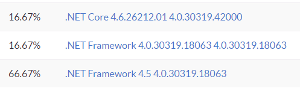

*Edit: I've created a repository on GitHub to expose an API which simplifies getting runtime, operating system and other platform information: <https://github.com/getsentry/dotnet-sentry-platform-abstractions>*

*If you are interested in contributing, please let me know. A [few issues were created](https://github.com/getsentry/dotnet-sentry-platform-abstractions) to discuss API design and features, feel free to drop a message there.*

*There is already code to detect the different [installations of the .NET Framework](https://github.com/getsentry/dotnet-sentry-platform-abstractions/blob/0bec1b58af1ae8abbc2b7f23ea43113b44d4acfa/src/Sentry.PlatformAbstractions/FrameworkInfo.cs) installed and also what [runtime the code is running on.](https://github.com/getsentry/dotnet-sentry-platform-abstractions/blob/0bec1b58af1ae8abbc2b7f23ea43113b44d4acfa/src/Sentry.PlatformAbstractions/RuntimeInfo.cs) Preview versions are [available on NuGet.org.](https://www.nuget.org/packages/Sentry.PlatformAbstractions)*

An output from the sample app is [included under the samples directory](https://github.com/getsentry/dotnet-sentry-platform-abstractions).

*Read on for details:*

.NET Core is great multi-platform framework. In my previous job, most of the team members were working on Windows, I worked on a MacBook and we deployed stuff to CentOS and Windows Servers. Build servers had a mix of Windows Server 2012 R2, Windows Server 2016 and a lonely CentOS and it all worked just fine.

The truth is that there are lots of business applications which are built with .NET Framework in a variety of versions with active development. At my new job (it's been 2 weeks), there's a focus in integrating all kinds of technologies and frameworks/versions to make developer's life's easier. If for example you maintain a Windows Form application built 6 years ago, targeting .NET Framework 4.5 which [Microsoft has dropped support to 2 years ago](https://support.microsoft.com/en-us/lifecycle/search/548), it's possible that a tool like Sentry is even more vital to you. I'd still recommend you upgrade to 4.5.2 though, at least, if possible.

Because of that, it's one of Sentry's .NET SDKs goals to target as many framework versions as possible. It currently even supports .NET 3.5 which was released 10 years ago and [cannot be built with the new msbuild SDK](https://github.com/dotnet/msbuild/issues/1333).

While working on adding a feature to Sentry's SDK which augments the events sent to Sentry with data about the system where the app is running, I was presented with a different set of APIs available to different versions of the framework. For example, when targeting **netstandard2.0**, it's possible to retrieve the framework information with:

```csharp
System.Runtime.InteropServices.RuntimeInformation.FrameworkDescription
```

This API does not exist in versions prior to 4.5. My first idea was to [copy the CoreFX implementation](https://github.com/dotnet/corefx/blob/c46e2e98b77d8c5eb2bc147df13b1505cf9c041e/src/System.Runtime.InteropServices.RuntimeInformation/src/System/Runtime/InteropServices/RuntimeInformation/RuntimeInformation.cs) but once I saw the `#ifdef`'s I realized it's not possible as I'm not generating assemblies just to have .NET Native or .NET Framework etc. This was just one example, there are many more APIs I'd like to use that will differ depending on the target framework.

## CoreThrower

To help me test different scenarios, I wrote a [script (batch and bash versions) to build and run a simple app](https://github.com/bruno-garcia/dotnet-sentry-thrower) that throws an error with the Sentry .NET SDK restored from some local path. It has the following targets:

1. netcoreapp2.0
2. net471
3. net46
4. net452
5. net45
6. net40

Considering that all .NET 4.x are *in-place* installations, all I'm doing here is making sure I can build the app and load the NuGet package against those versions. Compiling uses reference assemblies to ensure compatibility. In runtime, it'll use the v4.0 folder with the CLR 4.0.

The .NET Core 2 version runs with CoreCLR on all platforms. The full framework versions will run with Mono on macOS and Linux and on Windows, the desktop (full) .NET Framework.

This tool is useful to me to get a locally built Sentry SDK and run in different environments. I ran it on:

1. macOS 10.13.3 High Sierra
2. Windows 10 Pro Fall Creator
3. Ubuntu 16.04.3 LTS (Windows Subsystem for Linux)
4. Windows 7 32bit
5. CentOS 7

All of them have .NET Core SDK 2.1.104.

While dealing with the full framework builds and runs I had a few surprises though:

## Windows 7 x86

I verified ([through the Windows registry](https://docs.microsoft.com/en-us/dotnet/framework/migration-guide/how-to-determine-which-versions-are-installed)) that the Windows 7 machine has version .NET Release number 378389. That means the plain .NET Framework 4.5. Although 4.7.1 is compatible with Windows 7 32 bits, I decided not to update it to verify which versions of the program and the SDK would work properly. I copied the reference assemblies to allow me to build all versions:

Windows 10 (64 bits): `C:\Program Files (x86)\Reference Assemblies\Microsoft\Framework`

To the Win7 (32 bits): `C:\Program Files\Reference Assemblies\Microsoft\Framework`

At this point running `run.cmd` successfully compiled all versions and **ran** all versions! That was to my surprise since the versions ahead of 4.5 could very well fail. It does make sense though since the application itself is not using any .NET 4.6+ API and Sentry's SDK is targeting net45 as the latest besides netstandard2.0.

That also means that the netstandard2.0 version was not restored to any of the net4x versions. Considering I'm using the [.NET Core 2.0 SDK I would expect the targets net46 and net471 to restore the netstandard2.0](https://docs.microsoft.com/en-us/dotnet/standard/net-standard) version of the Sentry SDK. Another possibility is that I have no idea why it worked ;)

At [sentry.io](https://sentry.io/) I see:



That surely needs some work: The events sent by the .NET Core version of the app shows the CoreCLR version (4.6.26212.01) followed by the .NET Framework 4.6+ version (4.0.30319.42000) which is not even installed on the machine. The middle entry shows 4.0.30319.18063. At least the value looks correct. It represents .NET 4.5 on Windows 7 SP1.

The values presented have two parts where the first is runtime **name** and the second is the **version** which was coming from the API:

```csharp
System.Environment.Version
```

Microsoft does have a disclaimer on this API:

> *For the .NET Framework 4.5 and later, we do not recommend using the Version property to detect the version of the runtime; instead, you can determine the version of the common language runtime by querying the registry. For more information, see [How to: Determine Which .NET Framework Versions Are Installed](https://msdn.microsoft.com/en-us/library/hh925568(v=vs.110).aspx).*

The version **name** and **number** get combined and depending on the version of the framework the code compiled against it shows the latest .NET Framework installed or simply the CLR version.

Needs work but for now lets see what shows up on the other systems:

## Ubuntu 16.04 (WSL)

The WSL installation of Ubuntu I have, included OOTB Mono version 4.6.2:

```
$ mono --version
Mono JIT compiler version 4.6.2 (Debian 4.6.2.7+dfsg-1)
Copyright (C) 2002-2014 Novell, Inc, Xamarin Inc and Contributors. www.mono-project.com
    TLS:           __thread
    SIGSEGV:       altstack
    Notifications: epoll
    Architecture:  amd64
    Disabled:      none
    Misc:          softdebug
    LLVM:          supported, not enabled.
    GC:            sgen
```

This version does [not implement netstandard2.0](https://docs.microsoft.com/en-us/dotnet/standard/net-standard). That was only introduced in version 5.4 back in November 2017. I took the same approach I had with the Win7 box: Try to build and run with an older version.

With the exception of the `netcoreapp2.0` target, nothing would build. Using [FrameworkPathOverride](https://github.com/dotnet/netcorecli-fsc/wiki/.NET-Core-SDK-1.0.1#using-net-framework-as-targets-framework-the-osxunix-build-fails) [I configured the projects' csproj](https://github.com/bruno-garcia/dotnet-sentry-thrower/blob/master/CoreThrower.csproj) to look into mono's path for the *reference assemblies* but realized that there was actually nothing there. [Considering Mono dropped support to pre-net45 reference assemblies on Mono 4](http://www.mono-project.com/docs/about-mono/releases/4.0.0/#dropped-support-for-old-frameworks) I had to install anyway the package for net40:

```bash
apt-get install mono-reference-assemblies-4.0
```

After that, I was still missing the newer packages. Makes sense since I was on an older version of Mono. This can be solved by taking them directly from GitHub:

```bash
cd /usr/lib/mono
sudo git clone https://github.com/mono/reference-assemblies.git
sudo cp -r reference-assemblies/v* .
sudo rm -rf reference-assemblies/
```

The directories still need renaming, to the expected format: remove `v` prefix and add `-api` suffix:

```bash
sudo sh -c 'for dir in v*; do mv "$dir" "${dir#v}-api"; done'
```

Build successful! That doesn't mean it will run and indeed it didn't. First error:

```
Running: bin/Release/net46/CoreThrower.exe

Unhandled Exception:
System.IO.FileNotFoundException: Could not load file or assembly
'System.Core, Version=4.0.0.0, Culture=neutral,
PublicKeyToken=b77a5c561934e089' or one of its dependencies.
```

[The first thread I found on the topic pointed out](https://github.com/KSP-CKAN/CKAN/issues/1871#issuecomment-241216399) that I need to have [libmono-system-core4.0-cil](https://packages.ubuntu.com/xenial/libmono-system-core4.0-cil) installed. 30 seconds later I was running it again... same error.

As pointed out further down in the same thread, `mono-complete` does the job:

```bash
sudo apt-get install mono-complete
```

Wait, what? Mono 4.2? I didn't change any of Ubuntu's package feed I don't think, did it just downgrade from 4.6.2 to 4.2.1?

```
Mono JIT compiler version 4.2.1 (Debian 4.2.1.102+dfsg2-7ubuntu4)
```

It looks like it did and if I now: `./run.sh`

Finally, it works!

At [sentry.io](https://sentry.io/) I see:


Although I've installed the same SDK version on both Win7 and Ubuntu, the latter is returning only 4.6.0.0 compared to 4.6.26212.01 returned on Windows.

## Windows 10 Pro

Straight forward. I have .NET Framework 4.7.1 and Visual Studio on this box so it built and ran without issues.


The first item is created by the net40 version of the app. Since it doesn't have the same APIs as net45+. It's using `Environment.Version` mentioned above which is far from ideal.

The rest of the results are OK with the exception of the "or higher" which came as a result of the version being higher than 461308. I'll need to rework this too.

## CentOS 7

Using the official [.NET Core](https://www.microsoft.com/net/download/linux-package-manager/centos/sdk-2.1.101) and [Mono](https://www.mono-project.com/download/stable/#download-lin-centos) install links I got their SDKs installed really quickly.

Latest Mono version: 5.10.1.20 and .NET Core SDK 2.1.101

Pull the code, pushed the nuget package to the checkout directory and ran `./run.sh`

Works fine and I get some events at sentry.io.


Like the Ubuntu version, .NET Core only includes the *major* and *minor* version numbers of the CoreCLR.

## macOS

The macOS device is my work computer so I might have installed reference assemblies before, I don't remember. Things ran just fine and the Mono version there is **5.8:**


It seems that only on Windows the API `RuntimeInformation.FrameworkDescription` returns the whole version number including build and revision.

## Other system information

Above I've discussed only the 'Runtime' context information that Sentry handles. There's much more data that Sentry's SDK will extract and send with events. Lots of them are challenging when multi-targeting from netstandard2.0 all the way down to net35 and running on Windows, macOS, Linux, Tizen, iOS, WebAssembly (blazor?) and whatever else we can use a .NET NuGet package in now and in the future.

## Conclusion

I still have a lot of work ahead to get this context data sent to sentry in a unambiguous way. This was just the first try though.
