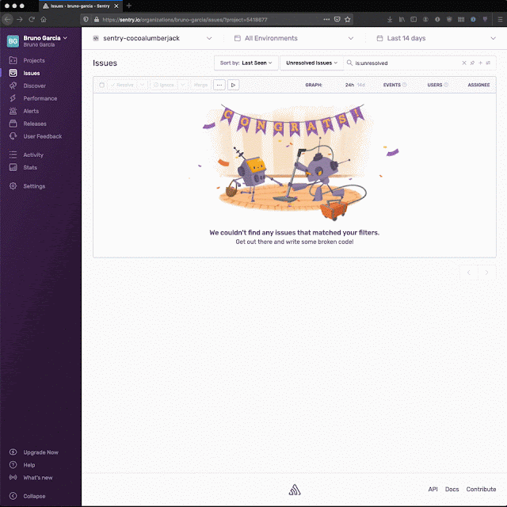

I haven't had much contact with Swift other than writing a few unit
tests on a project. So when someone asked about
<a href="https://forum.sentry.io/t/sending-log-files-to-sentry/10940"
target="_blank">sending CocoaLumberjack logs to Sentry on the forum</a>
I thought it was a good excuse to write some Swift on the weekend.

To create an integration between two libraries written in Objective-C,
to make sure you can support the most number of apps and platforms, the
choice for a language is obvious: Objective-C.

The best thing about such a hobby project is:

Making sure you can support old code bases, where the developers have
not invested in keeping things up-to-date doesn't not become a priority
to you.

With that in mind, I went ahead with the latest stable Swift version:
5.2.

At the start I learned that I actually don't need xcode at all. So as
part of my experiment, I decided to go without any of those
*xcworkspace*, *pbxproj*, *xcscheme* etc, and use only Visual Studio
Code.

And the Swift CLI: `swift build` and `swift run`.

With the <a
href="https://github.com/bruno-garcia/SentryCocoaLumberjack/tree/main/.vscode"
target="_blank">right Visual Studio tasks and launch configuration</a> I
was even able to step through the code with the debugger. Generally
really nice.

In the process I also learned about the <a
href="https://github.com/bruno-garcia/SentryCocoaLumberjack"
target="_blank">Swift Package Index</a> which builds your project with
different Swift versions and targets and creates a badge describing the
compatibility.

On top of all the fun learning a new language and ecosystem, I got a
<a href="https://twitter.com/brungarc/status/1302412609371676672"
target="_blank">good reminder that dogfooding</a> is an incredible tool.
Specially when you're building APIs and SDKs. I would even say that it
makes sense to have a project at work that the team could work together
a few hours a week to get a good verification of the experience of using
what you're building.

The code is here if you're interested:
<https://github.com/bruno-garcia/SentryCocoaLumberjack>

The low res gif I recorded:

